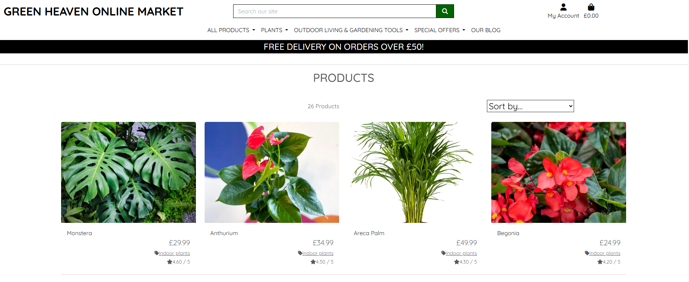
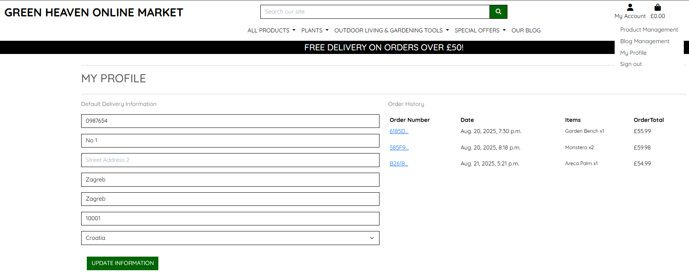
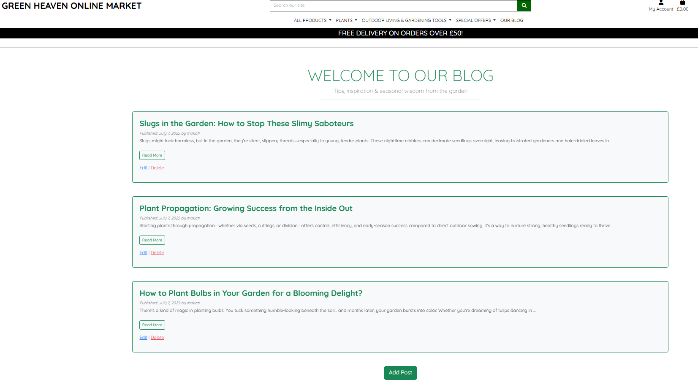
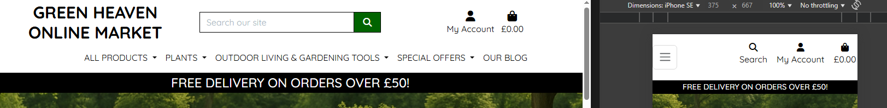

## Table of Contents

1. [Project Overview](#1-project-overview-green_heaven_online_market)
2. [Purpose of the Project](#2-purpose-of-the-project)
3. [User Stories](#3-user-stories)
4. [Typography and Color Scheme](#4-typography-and-color-scheme)
5. [Database Scheme](#5-database-scheme)
   - [ERD](#erd)
6. [Wireframes](#6-wireframes)
7. [Technologies](#7-technologies)
8. [Features](#8-features)
   - [Product Catalog](#1-product-catalog)
   - [Shopping Bag & Checkout](#2-shopping-bag--checkout)
   - [User Accounts](#3-user-accounts)
   - [Admin Features](#4-admin-features)
   - [Blog & Community](#5-blog--community)
   - [Responsive Design](#6-responsive-design)
   - [Security & Validation](#7-security--validation)
   - [Email Notifications](#8-email-notifications)
   - [Accessibility](#9-accessibility)
   - [Future Features](#10-future-features)
9. [Testing](#9-testing)
10. [Fixed Bugs](#10-fixed-bugs)
11. [Deployment](#11-deployment)
   - [Via VS Code](#111-via-vs-code)
   - [Via Heroku](#112-via-heroku)
12. [Credits](#12-credits)

---
# 1. Project overview: green_heaven_online_market
This is my fourth milestone project with Code Institute and Runshaw College. I used Django for this project.
# 2. Purpose of the project

The aim of this project is to develop an online garden center for an imaginary company, enabling them to effectively sell gardening products, plants, and seeds. This platform will enhance their marketing reach, providing a convenient 24/7 online presence and allowing customers to browse and shop from the comfort of their homes. The project seeks to streamline the shopping experience by offering easy navigation, personalized account features, and seamless checkout. Additionally, it will empower customers to discover new products, while helping the company attract a broader audience and increase sales.

# 3. User Stories

## As a Shopper
- I want to browse and search for gardening products, plants, and seeds so I can find what I need easily.
- I want to view detailed product information, including images, descriptions, prices, and ratings, to make informed decisions.
- I want to see deals, discounts, and recommendations so I can discover new items and save money.
- I want to add products to my shopping bag, adjust quantities, and see the total cost at any time to manage my purchases.
- I want a smooth and secure checkout process with email confirmation so I can trust my order is placed correctly.

## As a Registered User
- I want to create an account and log in/out so I can access personalized features and keep my information secure.
- I want to update my profile and view my order history so I can manage my account and track my purchases.
- I want to recover my password easily if I forget it.
- I want to save my payment information for faster future checkouts.
- I want to receive confirmation emails for registration and orders.

## As a Community Member
- I want to read gardening blog articles and tips to learn and get inspired.
- I want to comment on blog posts and interact with other users to share experiences.
- I want to see comments from other users in a clear and organized way.

## As an Administrator
- I want to add, edit, or remove products so the catalog stays up to date.
- I want to manage blog posts and moderate user comments to ensure quality content.
- I want to assist users with account or order issues to provide good customer support.
- I want to add ratings to products.

# 4. Typography and color scheme
## Typography

The site uses the **Roboto** font for body text and navigation, chosen for its readability and modern appearance. Headings use **Montserrat** for a clean, bold look that stands out. Both fonts are loaded via Google Fonts for consistency across devices.

- **Headings:** Montserrat, sans-serif
- **Body:** Roboto, sans-serif

## Color Scheme

The color palette is inspired by nature and gardening:\

- **Primary color:** #388E3C (deep green) — used for navigation bar, buttons, and accents.
- **Secondary color:** #C8E6C9 (light green) — background highlights and section dividers.
- **Accent color:** #FFB300 (warm yellow) — call-to-action buttons and highlights.
- **Background:** #FFFFFF (white) — main page background for clarity.
- **Text:** #212121 (dark gray) — for high contrast and readability.
- **Secondary text:** #555 (medium gray) — used for less prominent text, such as captions and hints.

This combination creates a fresh, inviting, and accessible interface suitable for a garden center.

# 5. Database Scheme
## ERD
I would like to use the django admin pannel for adding and updating product, and I would like to work with a delivery company to arrange deliveries.
.png)

# 6. Wireframes
- Home page

- Product list page

- Product page

- Check out page

- List of blog articles page

- Blog page


# 7. Technologies

This project uses the following core technologies and tools:

- **HTML5**  
   For structuring the web pages and content.

- **CSS3**  
   For styling, layout, and responsive design.

- **JavaScript**  
   For interactive features and client-side logic.

- **Python 3**  
   The main programming language for backend development.

- **Django**  
   The primary web framework used for building the backend, handling routing, models, authentication, and admin interface.

- **PostgreSQL**  
   The production database for storing all application data.

- **SQLite**  
   Used as the default database during local development.

- **Bootstrap**  
   For responsive design and pre-built UI components.

- **jQuery**  
   For simplifying DOM manipulation and AJAX requests.

- **Gunicorn**  
   As the WSGI HTTP server for deploying the Django app on Heroku.

- **Heroku**  
   For cloud deployment and hosting of the live application.

- **Amazon S3**  
   For storing and serving static and media files in production.

- **Stripe**  
   For secure payment processing during checkout.

- **Allauth**  
   For user authentication, registration, and social login support.

- **Crispy Forms**  
   For improved Django form rendering and styling.

- **Pillow**  
   For image processing and handling product images.

- **Git & GitHub**  
   For version control and source code management.

- **VS Code**  
   As the main code editor and development environment.

These technologies work together to provide a robust, secure, and user-friendly online garden center experience.

# 8. Features

### 1 Product Catalogue
- Browse products by category (plants, seeds, tools, etc.).
- View detailed product pages with images, descriptions, price.
- Search and filter products by name, category, price, and rating.



### 2 Shopping Bag & Checkout
- Add products to shopping bag, update quantity, remove items.
- View shopping bag summary with total cost.
- Secure checkout process with order confirmation and email receipt.


### 3 User Accounts
- Register and log in/out with email verification.
- Manage profile information and view order history.
- Password recovery and profile updates.



### 4 Admin Features
- Add, edit, and delete products.
- Manage blog posts and moderate user comments.
- Assist users with account or order issues.


### 5 Blog & Community
- Read gardening articles and tips.
- Registered users can comment on blog posts.
- Admins can publish, update, or delete blog content.



### 6 Responsive Design
- Fully responsive layout for mobile, tablet, and desktop.
- Navigation bar adapts to all screen sizes.



### 7 Security & Validation
- CSRF protection for forms.
- Input validation for user data and checkout.

### 8 Email Notifications
- Confirmation emails for registration and orders.

### 9 Accessibility
- Clear navigation and readable typography.
- Alt text for images and accessible forms.

### 10 Future features
It could be possible to upgrade the customer experince with these other features.

1. **Wishlist Functionality**  
   Allow users to save products to a wishlist for future purchase, making it easier to track items they are interested in.

2. **Loyalty Program**  
   Implement a points-based loyalty system where customers earn rewards for purchases, reviews, or referrals.

3. **Live Chat Support**  
   Add a live chat feature for real-time customer assistance, helping users with product questions and order issues.

4. **Rating buy customers**
   Customers can be able to rate products, or write feedback about them.


# 9. Testing
See [TESTING.md](TESTING.md).

# 10. Fixed bugs

   1. **Incorrect Product Image Upload**
      - *Bug*: Uploaded product images were not displaying due to incorrect media path configuration.
      - *Fix*: Updated `settings.py` to set `MEDIA_URL` and `MEDIA_ROOT` correctly, and added media serving in `urls.py` during development.

   2. **Checkout Total Calculation Error**
      - *Bug*: Shopping bag total was not updating when users changed product quantities.
      - *Fix*: Refactored the bag view logic to recalculate totals on every quantity update and added tests to verify accuracy.

   3. **Blog Comment Submission Failure**
      - *Bug*: Registered users could not submit comments due to missing CSRF token in the blog comment form.
      - *Fix*: Added `` to the comment form template and verified comment posting functionality.
# 11. Deployment
   ## 11.1 via VS Code
   To deploy this project locally using VS Code:

   - **Clone the repository**  
      Open a terminal and run:  
      ```bash
      git clone https://github.com/your-username/green_heaven_online_market.git
      cd green_heaven_online_market
      ```

   - **Create and activate a virtual environment**  
      ```bash
      python -m venv venv
      # On Windows:
      venv\Scripts\activate
      # On macOS/Linux:
      source venv/bin/activate
      ```

   - **Install dependencies**  
      ```bash
      pip install -r requirements.txt
      ```

   - **Apply migrations**  
      ```bash
      python manage.py migrate
      ```

   - **Create a superuser (optional, for admin access)**  
      ```bash
      python manage.py createsuperuser
      ```

   - **Run the development server**  
      ```bash
      python manage.py runserver
      ```

   - **Open the project**  
      Visit `http://127.0.0.1:8000/` in your browser.

   - **Access the admin panel**  
      Visit `http://127.0.0.1:8000/admin/` and log in with your superuser credentials.

   ## 11.2 via Heroku
   To deploy this project to Heroku, follow these steps:

   - **Log in to Heroku**  
      In your terminal, run:  
      ```bash
      heroku login
      ```

   - **Prepare your Django project for Heroku**  
      - Add `gunicorn` and `dj-database-url` to your `requirements.txt`.
      - Create a `Procfile` in your project root with:  
        ```
        web: gunicorn green_heaven_online_market.wsgi
        ```
      - Set `ALLOWED_HOSTS` in `settings.py` to include your Heroku app domain.
      - create .python-version file.

   - **Initialize a git repository (if not already done)**  
      ```bash
      git init
      git add .
      git commit -m "Prepare for Heroku deployment"
      ```

   - **Create a Heroku app**  
     In Heroku create a new app.

   - **Set environment variables**  
      Set any required environment variables in Heroku.

   - **Push your code to Heroku**  
      ```bash
      git push heroku main
      ```

   - **Apply migrations and collect static files**  
      ```bash
      heroku run python manage.py migrate
      heroku run python manage.py collectstatic
      ```

   - **Create a superuser (optional)**  
       ```bash
       heroku run python manage.py createsuperuser
       ```

   - **Change Deployement method**
      In Heroku change the deployment method to GitHub.
      Go to Deploy branch, check build log, if any problem.

   - **Open your deployed app**  
       In Heroku open the new app. (https://green-heaven-online-garden-cen-2439019d4b13.herokuapp.com/)

# 12. Credits
- Thank you for Code Institutet for the walkthrough projects, and for Runshaw College for the Tutoring support, which helped me a lot to build this application.
- Images from kaggle.com and Microsoft Copilot.
- I used Microsoft Copilot for check and debug code, helping with README.md, TESTING.md, and to write articles for the blog, to write product descriptions.
- Thanks for w3school.com. I used their code as a base for my project.
- Thanks for RHS for the plant description and growing information.
- I used Antonio Melé: Django 5 By Example to create the blog app with the comment section for this project.
- How to use [google logo](https://developers.google.com/identity/branding-guidelines).
- I got some help to Allauth from Pretty Printed on [Youtube](https://www.youtube.com/watch?v=mIlgzn2zuFE).