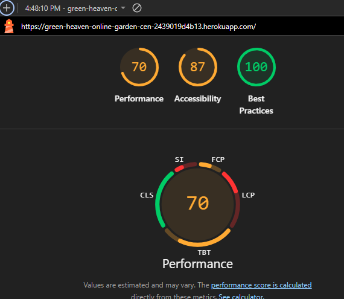

# green_heaven_online_market
This is my fourth milestone project with Code Institute and Runshaw College. I used Django for this project.
# 1. Purpose of the project
The aim of this project is to develop an online garden center for an imaginary company, enabling them to effectively sell gardening products, plants, and seeds. This platform will enhance their marketing reach, providing a convenient 24/7 online presence and allowing customers to browse and shop from the comfort of their homes. The project seeks to streamline the shopping experience by offering easy navigation, personalized account features, and seamless checkout. Additionally, it will empower customers to discover new products, while helping the company attract a broader audience and increase sales.
# 2. User stories
## Epic: As a shopper
- I want to browse a list of available products so I can explore my options.
- I want each product to have a detailed description so I can make informed decisions.
- I want to receive shopping inspirations and recommendations so I can discover new items.
- I want to easily identify deals and discounts so I can save money.
- I want to see the total cost of my purchases at any time so I can manage my budget.
- I want to search for items on the website so I can quickly find what I need.
- I want to select the quantity, color, and size of a product easily so I can customize my order.
- I want to receive an email confirmation after checking out so I can verify my purchase.
## Epic: As a registered user
- I want a navigation bar visible on all pages and screen sizes so I can easily move between sections.
- I want to create an account so I can access exclusive features.
- I want to sign in so I can use functions available to logged-in users.
- I want to sign out so my account remains secure.
- I want clear sign-in, sign-up, and log-out options so I can manage my account.
- I want to update my profile so I can keep my personal information accurate.
- I want to view my shopping history so I can review past purchases.
- I want to recover my password easily so I can regain access if I forget it.
- I want to receive a confirmation email when registering so I can verify my account.
- I want to save my payment information so I can speed up future purchases.
## Epic: As an administrator
- I want to add products to the website so I can sell new inventory.
- I want to edit product details such as image, description, and price so I can keep listings accurate.
- I want to delete products so I can remove items no longer available.
- I want to assist users with profile or order issues so I can provide customer support.
# 3. Features

### 3.1 Product Catalog
- Browse products by category (plants, seeds, tools, etc.).
- View detailed product pages with images, descriptions, price.
- Search and filter products by name, category, price, and rating.

### 3.2 Shopping Bag & Checkout
- Add products to shopping bag, update quantity, remove items.
- View shopping bag summary with total cost.
- Secure checkout process with order confirmation and email receipt.

### 3.3 User Accounts
- Register and log in/out with email verification.
- Manage profile information and view order history.
- Password recovery and profile updates.

### 3.4 Admin Features
- Add, edit, and delete products.
- Manage blog posts and moderate user comments.
- Assist users with account or order issues.

### 3.5 Blog & Community
- Read gardening articles and tips.
- Registered users can comment on blog posts.
- Admins can publish, update, or delete blog content.

### 3.6 Responsive Design
- Fully responsive layout for mobile, tablet, and desktop.
- Navigation bar adapts to all screen sizes.

### 3.7 Security & Validation
- CSRF protection for forms.
- Input validation for user data and checkout.

### 3.8 Email Notifications
- Confirmation emails for registration and orders.

### 3.9 Accessibility
- Clear navigation and readable typography.
- Alt text for images and accessible forms.
# 4. Future features
It could be possible to upgrade the customer experince with these other features.

1. **Wishlist Functionality**  
   Allow users to save products to a wishlist for future purchase, making it easier to track items they are interested in.

2. **Loyalty Program**  
   Implement a points-based loyalty system where customers earn rewards for purchases, reviews, or referrals.

3. **Live Chat Support**  
   Add a live chat feature for real-time customer assistance, helping users with product questions and order issues.
# 5. Typography and color scheme
## Typography

The site uses the **Roboto** font for body text and navigation, chosen for its readability and modern appearance. Headings use **Montserrat** for a clean, bold look that stands out. Both fonts are loaded via Google Fonts for consistency across devices.

- **Headings:** Montserrat, sans-serif
- **Body:** Roboto, sans-serif

## Color Scheme

The color palette is inspired by nature and gardening:\

- **Primary color:** #388E3C (deep green) — used for navigation bar, buttons, and accents.
- **Secondary color:** #C8E6C9 (light green) — background highlights and section dividers.
- **Accent color:** #FFB300 (warm yellow) — call-to-action buttons and highlights.
- **Background:** #FFFFFF (white) — main page background for clarity.
- **Text:** #212121 (dark gray) — for high contrast and readability.
- **Secondary text:** #555 (medium gray) — used for less prominent text, such as captions and hints.

This combination creates a fresh, inviting, and accessible interface suitable for a garden center.
# 6. Wireframes
- Home page

- Product list page

- Product page

- Check out page

- List of blog articles page

- Blog page

# 7. Technology
## 7.1. ERD
I would like to use the django admin pannel for adding and updating product, and I would like to work with a delivery company to arrange deliveries.
.png)
# 8. Testing
   ## 8.1 code validation
   ### 8.1.1 HTML validation
   There were no issues during HTML validation with [W3C](https://validator.w3.org/nu/?doc=https%3A%2F%2Fgreen-heaven-online-garden-cen-2439019d4b13.herokuapp.com%2F).\
    
   ### 8.1.2 CSS validation
   There were no issues during HTML validation with [W3C](https://jigsaw.w3.org/css-validator/validator?uri=https%3A%2F%2Fgreen-heaven-online-garden-cen-2439019d4b13.herokuapp.com%2F&profile=css3svg&usermedium=all&warning=1&vextwarning=&lang=en).\
   
   ### 8.1.3 Lighthouse
   I opened the website in Chrome Incognito mode (so the extensions doesn't influence the report), and I run the Lighthouse report, I got the following results:\
   
   ## 8.2 test cases (user story based with screenshots)
   ### User Account Features
   |Feature|User requirements addressed|Expected result|Actual result|Screenshot|Pass/Fail|Date|Correction|
   |-------|---------------------------|---------------|-------------|----------|---------|----|----------|
   |Sign Up|New users can register by providing essential information, enabling personalized access.|Registration is successful and user redirected to dashboard or login.|As expected.|[Sign Up](media/readme/Signup.png)|Pass|4/8/25|None|
   |Sign in|Registered users authenticate their identity to access their accounts securely.|User logs in and is redirected to homepage or dashboard.|As expected.|[Sign In](media/readme/signin.PNG)|Pass|4/8/25|None|
   |Sign Out|Registered users can log out, when theydon't use their account.|Session ends and user is redirected to landing page.|As expected.|[Sign Out](media/readme/Signout.PNG)|Pass|4/8/25|None|
   |Profile display|Users can view their profile dashboard.|All user details and recent activity are visible.|As expected.|[Profile display](media/readme/Myprofile.PNG)|Pass|4/8/25|None|
   |Profile management|Users can edit personal details, check their placed orders from their profile dashboard.|Changes are saved correctly and order history displays accurate information.|As expected.|[Profile management](media/readme/Myprofile.PNG)|Pass|4/8/25|None|
   ### Content and Community Features
   |Feature|User requirements addressed|Expected result|Actual result|Pass/Fail|Date|Correction|
   |-------|---------------------------|---------------|-------------|---------|----|----------|
   |Blog display|Visitors can view blog posts, and read content.|Blog pages load correctly with title, content, and metadata.|As expected.|[Blog display](media/readme/blog_display.PNG)|Pass|4/8/25|None|
   |Blog management|Admins can publish, update, or delete blog posts.|Changes are reflected in real time; content updates correctly.|As expected.|[Blog management](media/readme/blog-man.PNG)|Pass|4/8/25|None|
   |Comments display|Users can view other user's comments.|Comments appear in chronological order with usernames.|As expected.|[Comments display](media/readme/comments-display.PNG)|Pass|4/8/25|None|
   |Comments management|Registered users can leave, update, delete comments on blog posts.|Comments are posted/edited/deleted with correct permissions.|As expected.|[Comment management](media/readme/comment-man.PNG)|Pass|4/8/25|None|
   ### E-Commerce Features
   |Feature|User requirements addressed|Expected result|Actual result|Pass/Fail|Date|Correction|
   |-------|---------------------------|---------------|-------------|---------|----|----------|
   |Product display|Products are showcased with images, descriptions, prices, rating.|Product listings load correctly with full details.|As expected.|[Product display](/media/readme/product-display.PNG)|Pass|4/8/25|None|
   |Product management|Admins can add, edit, or remove listings.|Product catalog updates reflect changes instantly.|As expected.|[Add product](media/readme/add-product.PNG) and [Edit product](media/readme/edit-product.PNG)|Pass|4/8/25|None|
   |Bag display|Users can view their shopping bag.|Items in bag are visible and accurately totaled.|As expected.|[Bag display](media/readme/shopping-bag.PNG)|Pass|4/8/25|None|
   |Bag management|Users select products to add to their shopping bag, quantity, selection can be updated before checkout.|Bag updates instantly; correct price and stock shown.|As expected.|[Bag management](media/readme/shopping-bag.PNG)|Pass|4/8/25|None|
   |Check out|Registered users can securely checkout.|Secure payment and order confirmation occurs with email.|As expected.|[Check Out](/media/readme/checkout.PNG)|Pass|4/8/25|None|
   ## 8.3 fixed bugs

   1. **Incorrect Product Image Upload**
      - *Bug*: Uploaded product images were not displaying due to incorrect media path configuration.
      - *Fix*: Updated `settings.py` to set `MEDIA_URL` and `MEDIA_ROOT` correctly, and added media serving in `urls.py` during development.

   2. **Checkout Total Calculation Error**
      - *Bug*: Shopping bag total was not updating when users changed product quantities.
      - *Fix*: Refactored the bag view logic to recalculate totals on every quantity update and added tests to verify accuracy.

   3. **Blog Comment Submission Failure**
      - *Bug*: Registered users could not submit comments due to missing CSRF token in the blog comment form.
      - *Fix*: Added `` to the comment form template and verified comment posting functionality.
   ## 8.4 supported screens and browsers
   ### Supported Screens and Browsers

   | Device/Screen Size          | Page Tested           | Browser(s) Tested         | Result                                  | Screenshot                                   | Pass/Fail | Date    | 
   |----------------------------|-----------------------|---------------------------|------------------------------------------|-----------------------------------------------|-----------|---------|
   | Mobile (iPhone SE)| Homepage Navigation   | Chrome            | Menu collapses, navigation works         | [iPhone SE Home](media/readme/mobile-hp-navbar.png) | Pass      | 4/8/25  | 
   | Mobile (iPhone SE)| Product Display Page  | Chrome           | Product info visible, images scale       | [iPhone SE Product](media/readme/mobile-pp.png) | Pass      | 4/8/25  | 
   | Mobile (iPhone SE)| Checkout              | Chrome           | Form fields accessible, payment works    | [iPhone SE Checkout](media/readme/phone-checkout.png) | Pass      | 4/8/25  | 
   | Mobile (iPhone SE)| Blog Page             | Chrome            | Blog readable, comments visible          | [iPhone SE Blog](media/readme/mobile-blog.png) | Pass      | 4/8/25  | 
   | Tablet (Nest Hub)| Homepage Navigation   | Chrome, Edge                    | Navigation bar visible, links work       | [Nest Hub Home](media/readme/tablet-hp-navbar.png) | Pass      | 4/8/25  | 
   | Tablet (Nest Hub)| Product Display Page  | Chrome, Edge                    | Product grid adapts, images clear        | [Nest Hub Product](media/readme/tablet-pp.png) | Pass      | 4/8/25  | 
   | Tablet (Nest Hub)| Checkout              | Chrome, Edge                   | All fields accessible, summary visible   | [Nest Hub Checkout](media/readme/tablet-checkout.png) | Pass      | 4/8/25  | 
   | Tablet (Nest Hub)| Blog Page             | Chrome, Edge                    | Blog and comments readable               | [Nest Hub Blog](media/readme/tablet-blog.png) | Pass      | 4/8/25  | 
   | Desktop         | Homepage Navigation   | Chrome, Edge    | Full menu, navigation works              | [Desktop Home](media/readme/desktop-hp-navbar.png) | Pass      | 4/8/25  | 
   | Desktop        | Product Display Page  | Chrome, Edge     | Product grid, images sharp               | [Desktop Product](media/readme/desktop-pp.png) | Pass      | 4/8/25  | 
   | Desktop         | Checkout              | Chrome, Edge   | All fields, payment, summary visible     | [Desktop Checkout](media/readme/desktop-checkout.png) | Pass      | 4/8/25  |
   | Desktop        | Blog Page             | Chrome, Edge    | Blog and comments visible, formatted     | [Desktop Blog](media/readme/desktop-blog.png) | Pass      | 4/8/25 |
   ## 9.1 via VS Code
   To deploy this project locally using VS Code:

   - **Clone the repository**  
      Open a terminal and run:  
      ```bash
      git clone https://github.com/your-username/green_heaven_online_market.git
      cd green_heaven_online_market
      ```

   - **Create and activate a virtual environment**  
      ```bash
      python -m venv venv
      # On Windows:
      venv\Scripts\activate
      # On macOS/Linux:
      source venv/bin/activate
      ```

   - **Install dependencies**  
      ```bash
      pip install -r requirements.txt
      ```

   - **Apply migrations**  
      ```bash
      python manage.py migrate
      ```

   - **Create a superuser (optional, for admin access)**  
      ```bash
      python manage.py createsuperuser
      ```

   - **Run the development server**  
      ```bash
      python manage.py runserver
      ```

   - **Open the project**  
      Visit `http://127.0.0.1:8000/` in your browser.

   - **Access the admin panel**  
      Visit `http://127.0.0.1:8000/admin/` and log in with your superuser credentials.

   ## 9.2 via Heroku
   To deploy this project to Heroku, follow these steps:

   - **Log in to Heroku**  
      In your terminal, run:  
      ```bash
      heroku login
      ```

   - **Prepare your Django project for Heroku**  
      - Add `gunicorn` and `dj-database-url` to your `requirements.txt`.
      - Create a `Procfile` in your project root with:  
        ```
        web: gunicorn green_heaven_online_market.wsgi
        ```
      - Set `ALLOWED_HOSTS` in `settings.py` to include your Heroku app domain.
      - create .python-version file.

   - **Initialize a git repository (if not already done)**  
      ```bash
      git init
      git add .
      git commit -m "Prepare for Heroku deployment"
      ```

   - **Create a Heroku app**  
     In Heroku create a new app.

   - **Set environment variables**  
      Set any required environment variables in Heroku.

   - **Push your code to Heroku**  
      ```bash
      git push heroku main
      ```

   - **Apply migrations and collect static files**  
      ```bash
      heroku run python manage.py migrate
      heroku run python manage.py collectstatic
      ```

   - **Create a superuser (optional)**  
       ```bash
       heroku run python manage.py createsuperuser
       ```

   - **Change Deployement method**
      In Heroku change the deployment method to GitHub.
      Go to Deploy branch, check build log, if any problem.

   - **Open your deployed app**  
       In Heroku open the new app. (https://green-heaven-online-garden-cen-2439019d4b13.herokuapp.com/)

# 10. Credits
- images from kaggle.com and Microsoft Copilot.
- I used Microsoft Copilot for check and debug code, write articles for the blog, write product descriptions.
- thanks for w3school.com.
- thanks for RHS for the plant description and growing information.
- I used Antonio Melé: Django 5 By Example to create the blog app for this project.
- How to use [google logo](https://developers.google.com/identity/branding-guidelines).
- I got some help to Allauth from Pretty Printed on [Youtube](https://www.youtube.com/watch?v=mIlgzn2zuFE).