# Testing
## Table of Contents

1. [Code Validation](#1-code-validation)
    - [HTML Validation](#11-html-validation)
    - [CSS Validation](#12-css-validation)
    - [JavaScript Validation](#13-javascript-validation)
    - [Python Validation](#14-python-validation)
    - [Lighthouse Reports](#15-lighthouse-reports)
2. [Manual Testing](#2-manual-testing)
    - [Test Cases (User Story Based)](#21-test-cases-user-story-based)
        - [User Account Features](#user-account-features)
        - [Content and Community Features](#content-and-community-features)
        - [E-Commerce Features](#e-commerce-features)
    - [Supported Screens and Browsers](#22-supported-screens-and-browsers)
3. [Stripe Webhook Testing](#3-stripe-webhook-testing)

This document describes the testing approach for the Green Heaven Online Market project. It covers validation tools, manual test cases, device/browser compatibility, and Stripe webhook verification.

## 1. Code Validation

### 1.1 HTML Validation

- Used [W3C Validator](https://validator.w3.org/nu/?doc=https%3A%2F%2Fgreen-heaven-online-garden-cen-2439019d4b13.herokuapp.com%2F).
- No issues found most of the time.\

- However the CSRF token appears to have no functional impact and may interfere with HTML rendering when embedded in unquoted attribute values(Profile page, Blog management, Product management). Despite this conflict, implementing the CSRF token remains essential for maintaining security within the web application.\
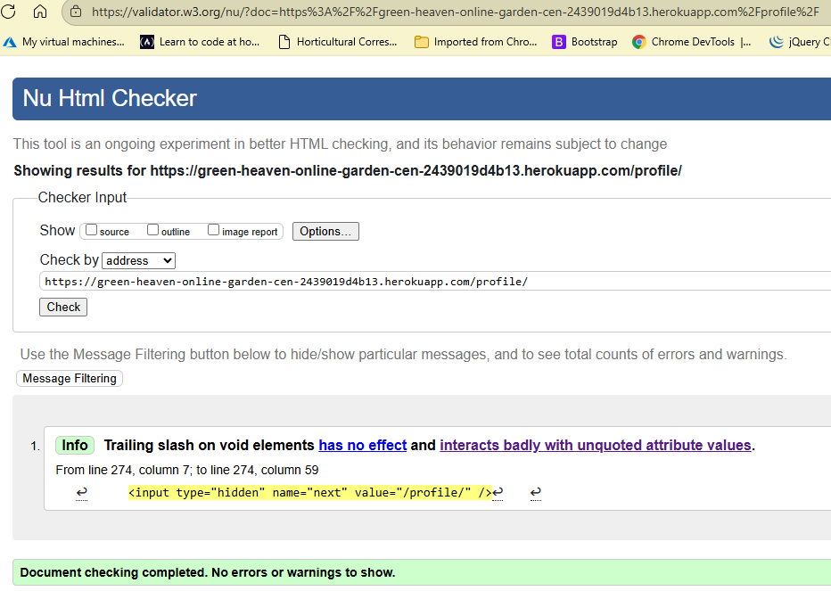

### 1.2 CSS Validation

- Used [W3C CSS Validator](https://jigsaw.w3.org/css-validator/validator?uri=https%3A%2F%2Fgreen-heaven-online-garden-cen-2439019d4b13.herokuapp.com%2F&profile=css3svg&usermedium=all&warning=1&vextwarning=&lang=en).
- No issues found.\

### 1.3 JavaScript Validation

All JavaScript scripts were validated using JSHint. Each script passed without issues.

| Script                | Tool    | Result         | Screenshot                                      |
|-----------------------|---------|----------------|-------------------------------------------------|
| base.html             | JSHint  | No issues      | 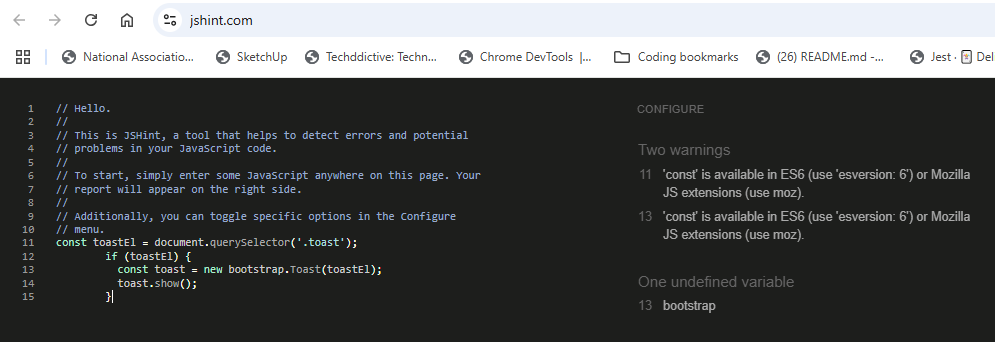        |
| bag.html              | JSHint  | No issues      | 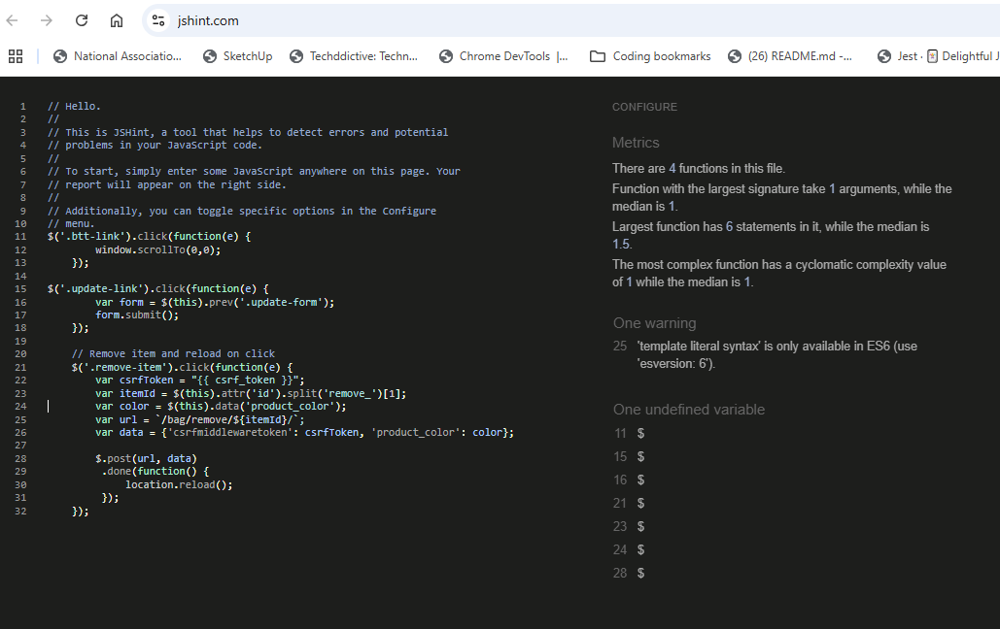            |
| add_article.html      | JSHint  | No issues      | 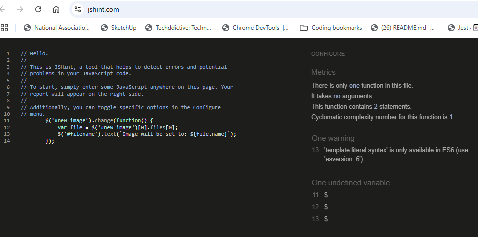 |
| edit_article.html     | JSHint  | No issues      |  |
| stripe_elements.js    | JSHint  | No issues      |  |
| subscription_success.html | JSHint | No issues   |  |
| quantity_input_script.html | JSHint | No issues |  |
| add_product.html      | JSHint  | No issues      |  |
| products.html         | JSHint  | No issues      |       |
| countryfield.js       | JSHint  | No issues      |  |
| accounts.js           | JSHint  | No issues      |      |
| edit_product.html     | JSHint  | No issues      |  |
| onload.js             | JSHint  | No issues      |          |

### 1.4 Python Validation

- Linting Tool: Utilized Flake8 to perform static code analysis and enforce Python coding standards.
- Installation: Installed via\
 `pip install flake8`.\
 
- Configuration: Excluded directories and files that are not relevant to linting, including:\
`flake8 --exclude=.venv,migrations,tests/temp.py`
    - .venv (virtual environment)
    - migrations/ (auto-generated files)
    - Empty files
- Observations: Some files contain long lines or tab characters. These were flagged by Flake8 but do not impact code execution.\

### 1.5 Lighthouse Reports

Lighthouse audits were run in Chrome Incognito mode to avoid extension interference. Results for key pages:
| Page                        | Screenshot                                               | Notes                |
|-----------------------------|----------------------------------------------------------|----------------------|
| Home page                   |                     | Performance needs work, but the rest is excellent.    |
| Product list                |  | Performance isn't good, mainly because of the pictures, but the rest is good.     |
| Product page                |      | Performance needs work, but the rest is excellent.      |
| Checkout                    |         | Performance needs work, but the rest is excellent.   |
| Blog list                   |       | Performance needs work, but the rest is excellent.        |
| Blog article                | | Performance needs work, but the rest is excellent.      |
| User profile                |           | Performance needs work, but the rest is excellent.           |
| Shopping bag                | 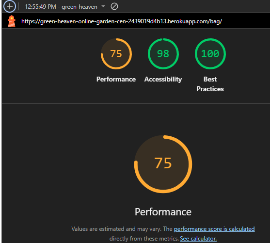| Performance needs work, but the rest is excellent.        |
| Sign up/in                  |           | Performance needs work, but the rest is excellent.          |
| Order confirmation          |  | Performance needs work, but the rest is excellent.  |
| Admin product management    |  | Admin only      |
| Admin blog management       |  | Admin only           |

## 2. Manual Testing

### 2.1 Test Cases (User Story Based)

#### User Account Features

| Feature           | Requirement                                   | Expected Result                                 | Actual Result | Screenshot                                 | Pass/Fail | Date    | Correction |
|-------------------|-----------------------------------------------|-------------------------------------------------|--------------|--------------------------------------------|-----------|---------|------------|
| Sign Up           | Register new users                            | Registration successful, redirected             | As expected  |         | Pass      | 4/8/25  | None       |
| Sign In           | Authenticate users                            | Login and redirect                              | As expected  |         | Pass      | 4/8/25  | None       |
| Sign Out          | Log out users                                 | Session ends, redirect to landing page          | As expected  |       | Pass      | 4/8/25  | None       |
| Profile display   | View profile dashboard                        | Details and activity visible                    | As expected  |      | Pass      | 4/8/25  | None       |
| Profile management| Edit details, view orders                     | Changes saved, order history accurate           | As expected  |      | Pass      | 4/8/25  | None       |

#### Content and Community Features

| Feature           | Requirement                                   | Expected Result                                 | Actual Result | Screenshot                                 | Pass/Fail | Date    | Correction |
|-------------------|-----------------------------------------------|-------------------------------------------------|--------------|--------------------------------------------|-----------|---------|------------|
| Blog display      | View blog posts                               | Blog loads with title, content, metadata        | As expected  |      | Pass      | 4/8/25  | None       |
| Blog management   | Admin manage posts                            | Changes reflected in real time                  | As expected  |     | Pass      | 4/8/25  | None       |
| Comments display  | View comments                                 | Chronological, usernames shown                  | As expected  |  | Pass  | 4/8/25  | None       |
| Comments management| Add/edit/delete comments                     | Correct permissions, actions work               | As expected  |  | Pass  | 4/8/25  | None       |

#### E-Commerce Features

| Feature           | Requirement                                   | Expected Result                                 | Actual Result | Screenshot                                 | Pass/Fail | Date    | Correction |
|-------------------|-----------------------------------------------|-------------------------------------------------|--------------|--------------------------------------------|-----------|---------|------------|
| Product display   | Show products with details                    | Listings load with images, prices, ratings      | As expected  | 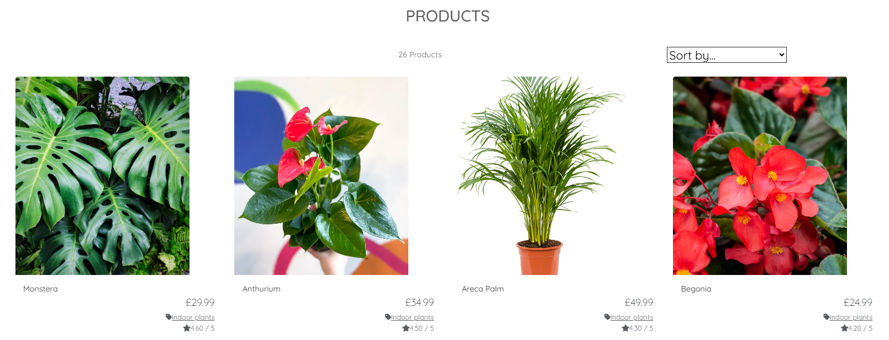 | Pass   | 4/8/25  | None       |
| Product management| Admin add/edit/remove products                | Catalog updates instantly                       | As expected  | ,  | Pass | 4/8/25 | None |
| Bag display       | View shopping bag                             | Items and totals visible                        | As expected  | 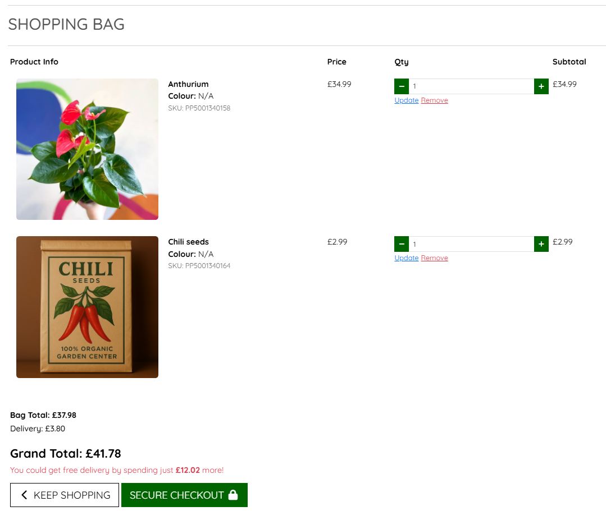      | Pass      | 4/8/25  | None       |
| Bag management    | Add/update items in bag                       | Bag updates, correct price/stock                | As expected  |  | Pass      | 4/8/25  | None       |
| Checkout          | Secure checkout for users                     | Payment and confirmation with email             | As expected  |     | Pass      | 4/8/25  | None       |

### 2.2 Supported Screens and Browsers

| Device/Screen      | Page                | Browser(s)      | Result                                      | Screenshot                                   | Pass/Fail | Date    |
|--------------------|---------------------|-----------------|----------------------------------------------|-----------------------------------------------|-----------|---------|
| iPhone SE          | Homepage            | Chrome          | Menu collapses, navigation works             |  | Pass      | 4/8/25  |
| iPhone SE          | Product Display     | Chrome          | Info visible, images scale                   | 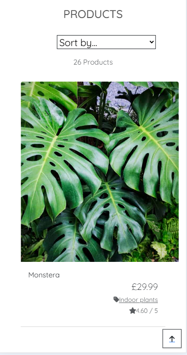 | Pass      | 4/8/25  |
| iPhone SE          | Checkout            | Chrome          | Fields accessible, payment works             | 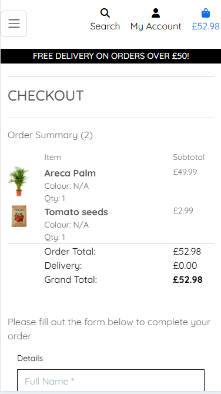 | Pass      | 4/8/25  |
| iPhone SE          | Blog Page           | Chrome          | Blog readable, comments visible              |  | Pass      | 4/8/25  |
| Nest Hub           | Homepage            | Chrome, Edge    | Nav bar visible, links work                  |  | Pass      | 4/8/25  |
| Nest Hub           | Product Display     | Chrome, Edge    | Grid adapts, images clear                    | 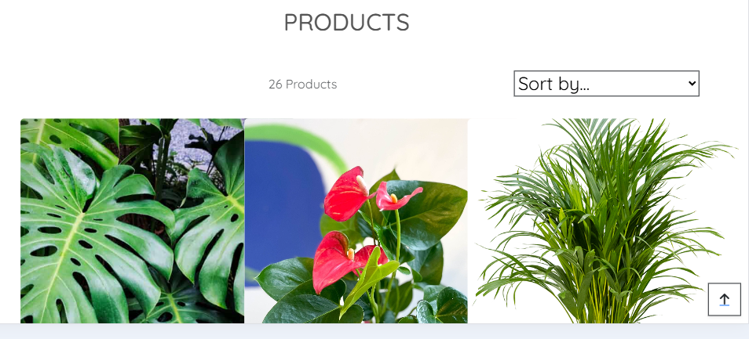 | Pass      | 4/8/25  |
| Nest Hub           | Checkout            | Chrome, Edge    | Fields accessible, summary visible           |  | Pass      | 4/8/25  |
| Nest Hub           | Blog Page           | Chrome, Edge    | Blog/comments readable                       | 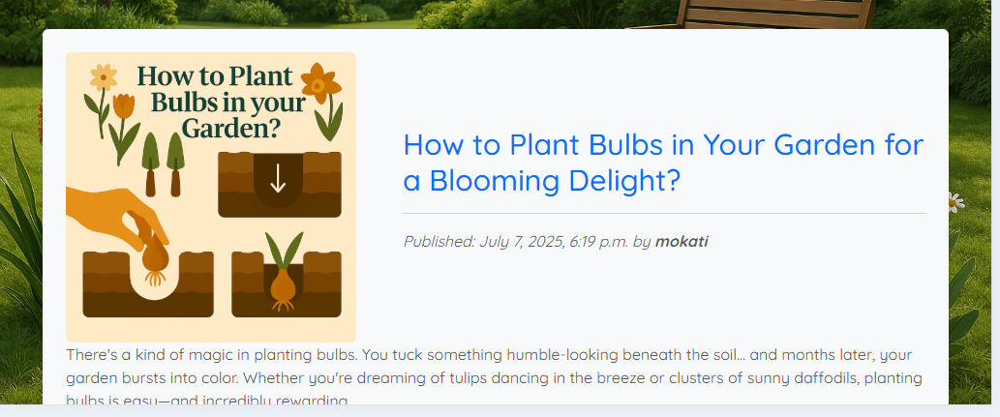 | Pass      | 4/8/25  |
| Desktop            | Homepage            | Chrome, Edge    | Full menu, navigation works                  |  | Pass      | 4/8/25  |
| Desktop            | Product Display     | Chrome, Edge    | Grid, images sharp                           | 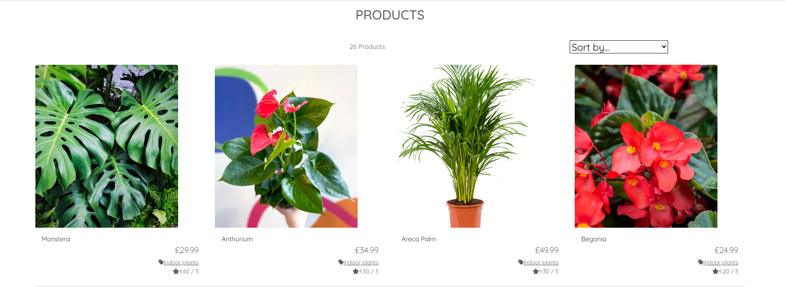 | Pass      | 4/8/25  |
| Desktop            | Checkout            | Chrome, Edge    | Fields, payment, summary visible             | 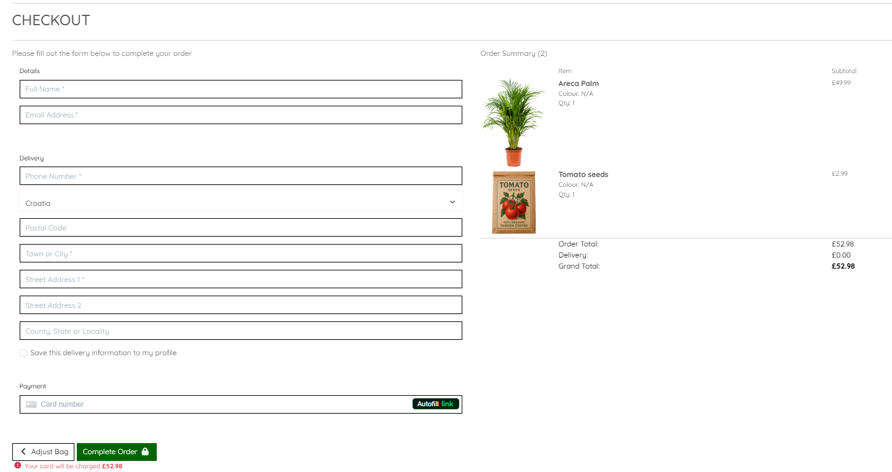 | Pass      | 4/8/25  |
| Desktop            | Blog Page           | Chrome, Edge    | Blog/comments visible, formatted             | 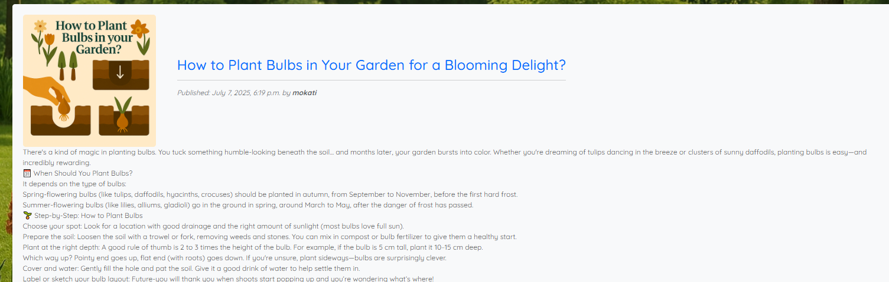 | Pass      | 4/8/25  |

## 3. Stripe Webhook Testing

### 3.1 In VS Code

- I opened 3 terminals.\
One for running the server:\
`python manage.py runserver`,\
Second one to listen to Stripe:\
`stripe listen --forward-to localhost:8000/checkout/wh/`,\
Stripe trigger in the third terminal.
- I verified events with success messages in terminal.\

### 3.2 In Stripe Dashboard

- I logged in to [Stripe](https://stripe.com/gb).
- Searched for Events.
- Here I could check the status and error messages of the different events.
- I could confirm successful payment processing for orders:\
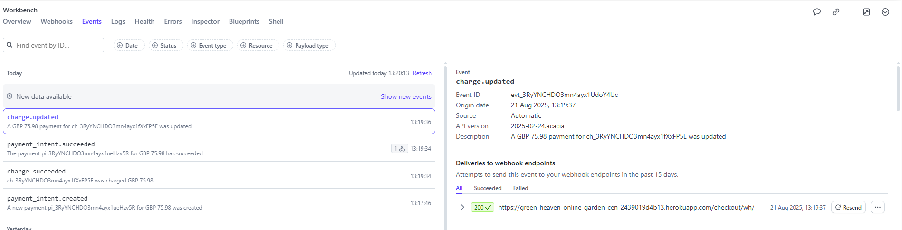