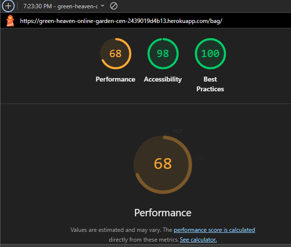
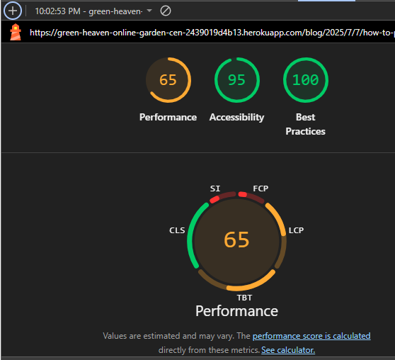
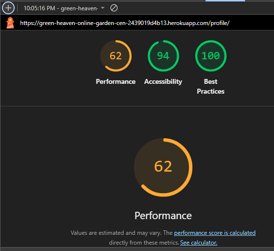

# Testing
## Table of Contents

1. [Validations](#1-code-validation)
    - [HTML validation](#11-html-validation)
    - [CSS validation](#12-css-validation)
    - [JS validation](#13-js-validation)
    - [Python validation](#14-python-validation)
    - [Lighthouse](#15-lighthouse)
2. [Manual testings](#2-manual-testings)
    - [Test cases (user story based with screenshots)](#21-test-cases-user-story-based-with-screenshots)
        - [User Account Features](#user-account-features)
        - [Content and Community Features](#content-and-community-features)
        - [E-Commerce Features](#e-commerce-features)
    - [Supported screens and browsers](#22-supported-screens-and-browsers)

This document outlines the testing strategies, tools, and procedures used in the Green Heaven Online Market project. It provides an overview of the types of tests implemented, including unit, integration, and end-to-end tests, as well as guidelines for running and contributing to the test suite.
   ## 1. code validation
   ### 1.1 HTML validation
   There were no issues during HTML validation with [W3C](https://validator.w3.org/nu/?doc=https%3A%2F%2Fgreen-heaven-online-garden-cen-2439019d4b13.herokuapp.com%2F).\
    
   ### 1.2 CSS validation
   There were no issues during HTML validation with [W3C](https://jigsaw.w3.org/css-validator/validator?uri=https%3A%2F%2Fgreen-heaven-online-garden-cen-2439019d4b13.herokuapp.com%2F&profile=css3svg&usermedium=all&warning=1&vextwarning=&lang=en).\
   
   ### 1.3 JS validation
Multiple JavaScript components are distributed throughout the project, requiring validation across 13 separate scripts. Each script was individually tested for errors and best practices compliance. Below are the validation results, organized by script, with corresponding screenshots for each:

| Script Name/Location | Validation Tool Used | Result | Screenshot |
|----------------------|---------------------|--------|------------|
| base.html           | [JSHint](https://jshint.com/)| No issues found |  |
| bag.html            | JSHint    | No issues found |  |
| add_article.html    | JSHint    | No issues found |  |
| edit_article.html   | JSHint    | No issues found |  |
| stripe_elements.js   | JSHint    | No issues found |  |
| subscription_success.html   | JSHint    | No issues found |  |
| quantity_input_script.html   | JSHint    | No issues found |  |
| add_product.html    | JSHint    | No issues found |  |
| products.html       | JSHint    | No issues found |  |
| countryfield.js     | JSHint    | No issues found |  |
| accounts.js         | JSHint    | No issues found |  |
| edit_product.html   | JSHint    | No issues found |  |
| onload.js           | JSHint    | No issues found |  |

   ### 1.4 Python validation
I used Flake8 to validate the Python code in this project:

1. Installed Flake8 using\
`pip install flake8`\

2. Added Flake8 to the system path.
3. Ran Flake8 on the project with\
`flake8 .`\
\
The output included many lines of feedback. I reviewed the results and addressed relevant issues. I excluded `.venv` directories, migration files, and unused/empty files (such as `tests.py`) from validation. Some files still contain long lines or tabs, but these do not affect code execution.
   ### 1.5 Lighthouse
   I opened the website in Chrome Incognito mode (so the extensions doesn't influence the report), and I run the Lighthouse report, I got the following results:\
    **Home page:**\
    \
    **Product list page:**\
    \
    **Product page:**\
    \
    **Check out page:**\
    \
    **List of blog articles page:**\
    \
    **Blog article page:**\
    \
    **User profile page:**\
    \
    **Shopping bag page:**\
    \
    **Sign up/sign in page:**\
    \
    **Order confirmation page:**\
    \
    **Admin dashboard (product management):**\
    \
    **Admin dashboard (blog management):**\
    \

   ## 2. Manual testings

   ### 2.1 test cases (user story based with screenshots)
   #### User Account Features
   |Feature|User requirements addressed|Expected result|Actual result|Screenshot|Pass/Fail|Date|Correction|
   |-------|---------------------------|---------------|-------------|----------|---------|----|----------|
   |Sign Up|New users can register by providing essential information, enabling personalized access.|Registration is successful and user redirected to dashboard or login.|As expected.|[Sign Up](media/readme/Signup.png)|Pass|4/8/25|None|
   |Sign in|Registered users authenticate their identity to access their accounts securely.|User logs in and is redirected to homepage or dashboard.|As expected.|[Sign In](media/readme/signin.PNG)|Pass|4/8/25|None|
   |Sign Out|Registered users can log out, when theydon't use their account.|Session ends and user is redirected to landing page.|As expected.|[Sign Out](media/readme/Signout.PNG)|Pass|4/8/25|None|
   |Profile display|Users can view their profile dashboard.|All user details and recent activity are visible.|As expected.|[Profile display](media/readme/Myprofile.PNG)|Pass|4/8/25|None|
   |Profile management|Users can edit personal details, check their placed orders from their profile dashboard.|Changes are saved correctly and order history displays accurate information.|As expected.|[Profile management](media/readme/Myprofile.PNG)|Pass|4/8/25|None|
   #### Content and Community Features
   |Feature|User requirements addressed|Expected result|Actual result|Pass/Fail|Date|Correction|
   |-------|---------------------------|---------------|-------------|---------|----|----------|
   |Blog display|Visitors can view blog posts, and read content.|Blog pages load correctly with title, content, and metadata.|As expected.|[Blog display](media/readme/blog_display.PNG)|Pass|4/8/25|None|
   |Blog management|Admins can publish, update, or delete blog posts.|Changes are reflected in real time; content updates correctly.|As expected.|[Blog management](media/readme/blog-man.PNG)|Pass|4/8/25|None|
   |Comments display|Users can view other user's comments.|Comments appear in chronological order with usernames.|As expected.|[Comments display](media/readme/comments-display.PNG)|Pass|4/8/25|None|
   |Comments management|Registered users can leave, update, delete comments on blog posts.|Comments are posted/edited/deleted with correct permissions.|As expected.|[Comment management](media/readme/comment-man.PNG)|Pass|4/8/25|None|
   #### E-Commerce Features
   |Feature|User requirements addressed|Expected result|Actual result|Pass/Fail|Date|Correction|
   |-------|---------------------------|---------------|-------------|---------|----|----------|
   |Product display|Products are showcased with images, descriptions, prices, rating.|Product listings load correctly with full details.|As expected.|[Product display](/media/readme/product-display.PNG)|Pass|4/8/25|None|
   |Product management|Admins can add, edit, or remove listings.|Product catalog updates reflect changes instantly.|As expected.|[Add product](media/readme/add-product.PNG) and [Edit product](media/readme/edit-product.PNG)|Pass|4/8/25|None|
   |Bag display|Users can view their shopping bag.|Items in bag are visible and accurately totaled.|As expected.|[Bag display](media/readme/shopping-bag.PNG)|Pass|4/8/25|None|
   |Bag management|Users select products to add to their shopping bag, quantity, selection can be updated before checkout.|Bag updates instantly; correct price and stock shown.|As expected.|[Bag management](media/readme/shopping-bag.PNG)|Pass|4/8/25|None|
   |Check out|Registered users can securely checkout.|Secure payment and order confirmation occurs with email.|As expected.|[Check Out](/media/readme/checkout.PNG)|Pass|4/8/25|None|

   ### 2.2 supported screens and browsers
   #### Supported Screens and Browsers

   | Device/Screen Size          | Page Tested           | Browser(s) Tested         | Result                                  | Screenshot                                   | Pass/Fail | Date    | 
   |----------------------------|-----------------------|---------------------------|------------------------------------------|-----------------------------------------------|-----------|---------|
   | Mobile (iPhone SE)| Homepage Navigation   | Chrome            | Menu collapses, navigation works         | [iPhone SE Home](media/readme/mobile-hp-navbar.png) | Pass      | 4/8/25  | 
   | Mobile (iPhone SE)| Product Display Page  | Chrome           | Product info visible, images scale       | [iPhone SE Product](media/readme/mobile-pp.png) | Pass      | 4/8/25  | 
   | Mobile (iPhone SE)| Checkout              | Chrome           | Form fields accessible, payment works    | [iPhone SE Checkout](media/readme/phone-checkout.png) | Pass      | 4/8/25  | 
   | Mobile (iPhone SE)| Blog Page             | Chrome            | Blog readable, comments visible          | [iPhone SE Blog](media/readme/mobile-blog.png) | Pass      | 4/8/25  | 
   | Tablet (Nest Hub)| Homepage Navigation   | Chrome, Edge                    | Navigation bar visible, links work       | [Nest Hub Home](media/readme/tablet-hp-navbar.png) | Pass      | 4/8/25  | 
   | Tablet (Nest Hub)| Product Display Page  | Chrome, Edge                    | Product grid adapts, images clear        | [Nest Hub Product](media/readme/tablet-pp.png) | Pass      | 4/8/25  | 
   | Tablet (Nest Hub)| Checkout              | Chrome, Edge                   | All fields accessible, summary visible   | [Nest Hub Checkout](media/readme/tablet-checkout.png) | Pass      | 4/8/25  | 
   | Tablet (Nest Hub)| Blog Page             | Chrome, Edge                    | Blog and comments readable               | [Nest Hub Blog](media/readme/tablet-blog.png) | Pass      | 4/8/25  | 
   | Desktop         | Homepage Navigation   | Chrome, Edge    | Full menu, navigation works              | [Desktop Home](media/readme/desktop-hp-navbar.png) | Pass      | 4/8/25  | 
   | Desktop        | Product Display Page  | Chrome, Edge     | Product grid, images sharp               | [Desktop Product](media/readme/desktop-pp.png) | Pass      | 4/8/25  | 
   | Desktop         | Checkout              | Chrome, Edge   | All fields, payment, summary visible     | [Desktop Checkout](media/readme/desktop-checkout.png) | Pass      | 4/8/25  |
   | Desktop        | Blog Page             | Chrome, Edge    | Blog and comments visible, formatted     | [Desktop Blog](media/readme/desktop-blog.png) | Pass      | 4/8/25 |